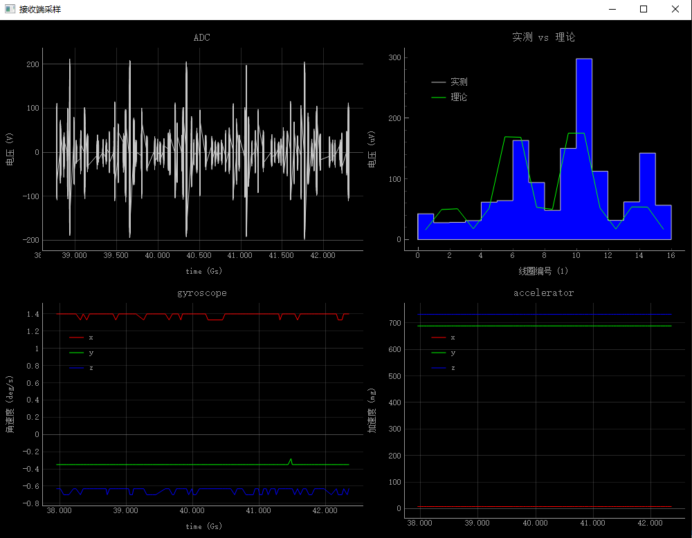
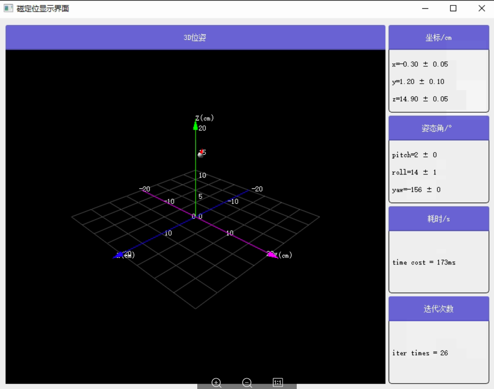

# coilTrack

## 1. 简介

&emsp;&emsp;基于python3的线圈阵列磁定位方法，使用外置的线圈阵列发射AC交变磁场，在胶囊内置线圈中产生感应信号，实现对胶囊的定位。

### 1.1 原理

**假设：**

- 线圈均可近似为磁偶极矩
- 线圈之间相对静止

以上图中的含义为：

+ $\vec{r}$: 接收线圈的位置矢量
+ $\vec{e_{m_1}}$: 发射线圈的朝向
+ $\vec{e_{m_2}}$: 接收线圈的朝向
+ $\theta$: $\vec{e_{m_2}}$与z轴的夹角
+ $\phi$: $\vec{e_{m_2}}$在xy平面的投影与x轴的夹角

当发射线圈中通正弦变化的电流$I(t)=Isin(2\pi ft+\phi)$时，接收线圈中产生的感应电动势E为：

$$
E=\frac{\mu_0n_1n_2S_1S_2fI}{2r^3}[3(\vec{e_r} \cdot \vec{e_{m_1}})(\vec{e_r} \cdot \vec{e_{m_2}})-\vec{e_{m_1}} \cdot \vec{e_{m_2}}]
$$

其中：

+ $n_1$: 发射线圈的匝数
+ $S_1$: 发射线圈的全面积（包含每一匝）
+ $\vec{e_{m_1}}$: 发射线圈的朝向
+ $n_2$: 接收线圈的匝数
+ $S_2$: 接收线圈的全面积（包含每一匝）
+ ``$\vec{e_{m_2}}$: 接收线圈的朝向``
+ $I$: 激励电流的幅值
+ $f$: 发射线圈的工作频率
+ ``$\vec{r}$: 接收线圈的位置矢量``

### 1.2 位姿的描述方法

以上各项中，除了$\vec{r}$和$\vec{e_{m_2}}$，其它都是已知量。线圈的位姿可用下三种方式描述：

1. 位置+四元数
   线圈的位置用$[x,\,y,\,z]$来描述。
   胶囊的姿态用$q=[q_0,\,q_1,\,q_2,\,q_3]$描述，其对应的旋转矩阵为
   $$
   R=\left[
   \begin{matrix}
   1-2q_2q_2-2q_3q_3 & 2q_1q_2-2q_0q_3 & 2q_1q_3+2q_0q_2\\
   2q_1q_2+2q_0q_3 & 1-2q_1q_1-2q_3q_3 & 2q_2q_3-2q_0q_1\\
   2q_1q_3-2q_0q_2 & 2q_0q_1+2q_2q_3 & 1-2q_1q_1-2q_2q_2
   \end{matrix}
   \right]
   $$

&emsp;&emsp;线圈在世界坐标下的朝向为

$$
\vec{e_{m_2}}=R
\left[
\begin{matrix}
0\\0\\1
\end{matrix}
\right]
$$

2. 李代数$se(3)$
   胶囊的姿态用$\xi=[\phi,\,\rho]\in R^6$描述，其对应的李群$SE(3)\in R^{4\times4}$为
   $$
   T=exp(\xi^\wedge)=
   \left[
   \begin{matrix}
   R & t \\
   0^T & 1
   \end{matrix}
   \right]=
   \left[
   \begin{matrix}
   exp(\phi^\wedge) & J\rho \\
   0^T & 1
   \end{matrix}
   \right]
   $$

&emsp;&emsp;其中，$\phi=\theta a$为旋转向量,表示其模长为$\theta$，方向为$a$
&emsp;&emsp;上式有：

$$
J=\frac{sin{\theta}}{\theta}I+(1-\frac{sin{\theta}}{\theta})aa^T+(1-\frac{cos{\theta}}{\theta})a^\wedge \\t=J\rho\\
\theta=arccos{\frac{tr(R)-1}{2}}
$$

&emsp;&emsp;线圈在世界坐标下的位置和朝向分别为

$$
\vec{r}=t\\\vec{e_{m_2}}=exp(\phi^\wedge)
\left[
\begin{matrix}
0\\0\\1
\end{matrix}
\right]
$$

3. 位置+球坐标系
   考虑到线圈是2D轴对称的圆柱形，可在球坐标系下描述其朝向，如下图所示：
   

&emsp;&emsp;以上图中的含义为：

+ $\vec{r}$: 接收线圈的位置矢量
+ $\vec{e_{m_1}}$: 发射线圈的朝向
+ $\vec{e_{m_2}}$: 接收线圈的朝向
+ $\theta$: $\vec{e_{m_2}}$与z轴的夹角
+ $\phi$: $\vec{e_{m_2}}$在xy平面的投影与x轴的夹角
  
  &emsp;&emsp;则线圈朝向可表示为：
  
  $$
  \vec{e_{m_2}}=[sin{\theta}cos{\phi},\,sin{\theta}sin{\phi},\,cos{\theta}]
  $$

## 2. 硬件

### 2.1 发射线圈

&emsp;&emsp;多个线圈呈阵列分布

- n1 = 205  `` 发射线圈匝数``
- nr1 = 9   `` 发射线圈层数``
- r1 = 5    `` 发射线圈内半径【mm】``
- d1 = 0.6  `` 发射线圈线径【mm】``
- distance = 100  ``发射线圈之间的距离[mm]``

发射线圈之间按照如下方式等距排列，按照从左到右，从上至下的顺序依次编号
``

### 2.2接收线圈

&emsp;&emsp;一个单轴的空心线圈

- n2 = 100   `` 接收线圈匝数``
- nr2 = 2    `` 接收线圈层数``
- r2 = 2.5   `` 接收线圈内半径【mm】``
- d2 = 0.05  `` 接收线圈线径【mm】``

### 2.3 驱动电路：

&emsp;&emsp;发射线圈依次工作，通过串口下发命令控制电路的启动和高低电平的时间。

- freq = 5000   `` 工作频率【Hz】``

### 2.4 采样电路

&emsp;&emsp;提取接收线圈的感应电压。
&emsp;&emsp;当前采用谐振电路拾取接收线圈的感应电压，然后两级运算放大器进行放大，总共放大1000倍，然后通过ADC采样转换为数字信号，由串口传输至PC端。

### 2.5 相关参数计算

$$
A=\mu_0N_1N_2S_1S_2fI=18347893 (I=2A)
$$

## 3. 代码组成

| 文件名             | 简介                                           |
| :----------------- | :--------------------------------------------- |
| agreement.py       | 读取接收端的串口通讯协议                       |
| LMpredictor.py     | 使用LM算法实现的定位方法，包含李代数se3        |
| UKFpredictor.py    | 使用UKF算法实现的定位方法                      |
| predictorViewer.py | 绘图工具，包括定位结果3D显示，仿真的误差分布等 |
| readData.py        | 实时读取接收端的数据，并实时显示出来           |
| coilArray.py       | 定义发射线圈和接收线圈参数的类                 |
| dataTool.py        | 数据处理函数，包含寻峰、FFT、绘图等            |
| Lie.py             | 李代数的实现                                   |
| requirements.txt   | 依赖包及版本号                                 |
| simluate.py        | 仿真程序                                       |
| pic/               | 图片信息                                       |
| data/              | 仿真和实际运行的数据                           |

## 4. 软件安装方法

- python >= 3.8
- pip工具升级到最新版本：``python3 -m pip install --upgrade pip``
- 依赖包的版本要求如requirements.txt所示
- 依赖包安装方法：pip install -r requirements.txt

## 5. 使用方法

#### 5.1 读取实时数据

&emsp;&emsp;运行 ``readData.py``，出现UI界面后通过串口工具向发射端发送启动命令

#### 5.2 实时定位

&emsp;&emsp;运行 ``UKFpredictor.py``，出现UI界面后通过串口工具向发射端发送启动命令

