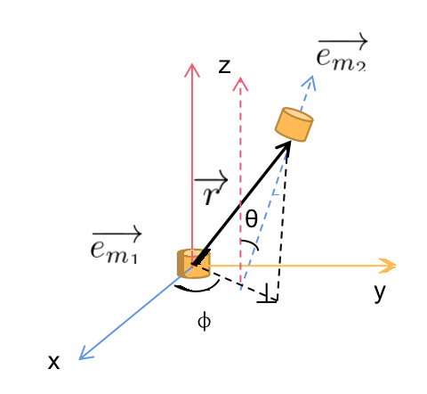
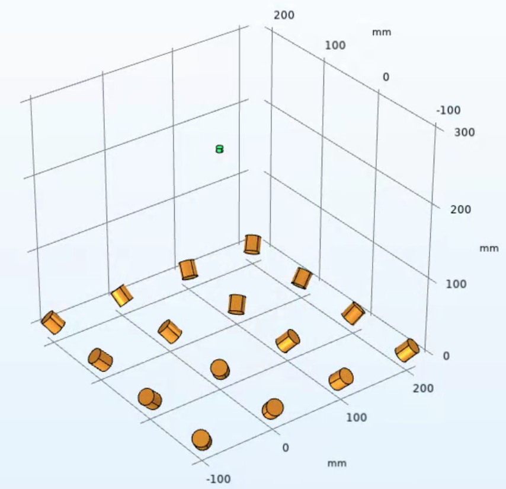

# 胶囊内镜的磁定位技术

## 1. 简介

 &emsp;&emsp;本文介绍了基于线圈电磁感应原理的磁定位方法：外置的线圈阵列依次发射AC交变磁场，在目标内置的接收线圈中产生感应信号，通过采集和处理感应信号，计算接收线圈的位置和姿态，实现对目标的定位。
 &emsp;&emsp;接下来，本文从系统层面介绍该技术，并给出软件的使用方法和结果展示。

### 1.1 原理

 **假设：**

- 所有线圈均可近似为磁偶极矩，即线圈尺寸远小于目标的位置

以上图中的含义为：

+ $\vec{r}$: 接收线圈的位置矢量
+ $\vec{e_{m_1}}$: 发射线圈的朝向
+ $\vec{e_{m_2}}$: 接收线圈的朝向

当发射线圈中通正弦变化的电流$I(t)=Isin(2\pi ft+\phi)$时，接收线圈中产生的感应电动势E为：

$$
E=\frac{\mu_0n_1n_2S_1S_2fI}{2r^3}[3(\vec{e_r} \cdot \vec{e_{m_1}})(\vec{e_r} \cdot \vec{e_{m_2}})-\vec{e_{m_1}} \cdot \vec{e_{m_2}}]
$$

其中：

+ $n_1$: 发射线圈的匝数
+ $S_1$: 发射线圈的平均截面积
+ $\vec{e_{m_1}}$: 发射线圈的朝向
+ $n_2$: 接收线圈的匝数
+ $S_2$: 接收线圈的平均截面积
+ $\vec{e_{m_2}}$: 接收线圈的朝向
+ $I$: 激励电流的幅值
+ $f$: 发射线圈的工作频率
+ $\vec{r}$: 接收线圈的位置矢量

### 1.2 设计指标

<table>
   <tr>
      <td>分类</td>
      <td colspan="2" style="text-align: center;">技术指标</td>
      <td>备注</td>
   </tr>
   <tr>
      <td rowspan="12">接收端</td>
   </tr>
   <tr>
      <td>接收线圈数量</td>
      <td>1</td>
      <td></td>
   </tr>
   <tr>
      <td>匝数</td>
      <td>100</td>
      <td></td>
   </tr>
   <tr>
      <td>尺寸</td>
      <td>5mm * 2mm</td>
      <td>外直径*长度</td>
   </tr>
   <tr>
      <td>线圈导线裸线径</td>
      <td>0.05mm</td>
      <td></td>
   </tr>
   <tr>
      <td>电阻</td>
      <td>15Ω</td>
      <td></td>
   </tr>
   <tr>
      <td>电感</td>
      <td>0.05mH</td>
      <td></td>
   </tr>
   <tr>
      <td>Q值</td>
      <td>0.104  / 0.416</td>
      <td>5KHz / 20KHz</td>
   </tr>
   <tr>
      <td>接收感应电压</td>
      <td>5~200uV</td>
      <td></td>
   </tr>
   <tr>
      <td>放大倍数</td>
      <td>1000/5000</td>
      <td>两级/三级放大</td>
   </tr>
   <tr>
      <td>输出采样电压</td>
      <td>5mV~0.2V/2.5mV~1V</td>
      <td>两级/三级放大</td>
   </tr>
   <tr>
      <td>信噪比</td>
      <td>>100</td>
      <td></td>
   </tr>
   <tr>
      <td rowspan="15">发射端</td>
   </tr>
   <tr>
      <td>发射线圈驱动电流</td>
      <td>≈2A</td>
      <td>带电流检测功能，准确度3%</td>
   </tr>
   <tr>
      <td>发射信号频率</td>
      <td>5KHz~20KHz</td>
      <td>5K，10K，20K三档可调</td>
   </tr>
   <tr>
      <td>发射线圈的功耗</td>
      <td><3W</td>
      <td></td>
   </tr>
   <tr>
      <td>发射线圈的轮流扫描时间</td>
      <td>5~20ms</td>
      <td></td>
   </tr>
   <tr>
      <td>发射线圈矩阵的面积</td>
      <td>45cm * 45cm </td>
      <td></td>
   </tr>
   <tr>
      <td>发射线圈个数</td>
      <td><=16</td>
      <td>争取使用9个</td>
   </tr>
   <tr>
      <td>匝数</td>
      <td>200</td>
      <td></td>
   </tr>
   <tr>
      <td>尺寸</td>
      <td>20mm * 15mm</td>
      <td>外直径*长度</td>
   </tr>
   <tr>
      <td>线圈导线裸线径</td>
      <td>0.6mm</td>
      <td></td>
   </tr>
   <tr>
      <td>电阻</td>
      <td>0.6Ω</td>
      <td></td>
   </tr>
   <tr>
      <td>电感</td>
      <td>0.31mH</td>
      <td></td>
   </tr>
   <tr>
      <td>Q值</td>
      <td>17.35 / 69.4</td>
      <td>5KHz/20KHz</td>
   </tr>
   <tr>
      <td>发射线圈的发热温度</td>
      <td><50℃</td>
      <td></td>
   </tr>
   <tr>
      <td>线圈一致性要求</td>
      <td><5%</td>
      <td>以电阻值为参考</td>
   </tr>
   <tr>
      <td rowspan="4">定位性能</td>
   </tr>
   <tr>
      <td>范围</td>
      <td>40cm * 30cm * 30cm</td>
      <td>磁控设备的x、y、z方向</td>
   </tr>
   <tr>
      <td>定位精度</td>
      <td>位置±5mm,姿态角±5°</td>
      <td></td>
   </tr>
   <tr>
      <td>刷新频率</td>
      <td>>2Hz</td>
      <td></td>
   </tr>
</table>

## 2. 硬件

### 2.1 发射线圈

&emsp;&emsp;多个线圈呈阵列分布

- n1 = 205  `` 发射线圈匝数``
- nr1 = 9   `` 发射线圈层数``
- r1 = 5    `` 发射线圈内半径【mm】``
- d1 = 0.6  `` 发射线圈线径【mm】``
- distance = 100  ``发射线圈之间的距离【mm】``

发射线圈之间按照如下方式等距排列，按照从左到右，从上至下的顺序依次编号

### 2.2接收线圈

&emsp;&emsp;一个单轴的空心线圈

- n2 = 100   `` 接收线圈匝数``
- nr2 = 2    `` 接收线圈层数``
- r2 = 2.5   `` 接收线圈内半径【mm】``
- d2 = 0.05  `` 接收线圈线径【mm】``

### 2.3 驱动电路：
&emsp;&emsp;硬件系统的原理由MCU控制波形发生器产生一个5K正弦波信号，然后经过放大，再通过一个信号切换电路，由MCU控制把信号切换到对应的发射驱动线圈，每个线圈有对应独立的驱动电路。驱动电路产生一个正比输入信号电压的电流信号。从而发射线圈产生交变磁场。

&emsp;&emsp;发射线圈依次工作，通过串口下发命令控制电路的启动和高低电平的时间。
控制命令的含义如下表所示：

|命令：|EB 90| 01| 32| 08| 01 90| 00| 00| 00| AA 55|
|-----|-----|---|---|---|------|---|---|---|------|
|释义:|帧头|1:开启 2：关闭|低电平时间[ms]|高电平时间[ms]|轮询间隔时间[ms]| | | | 帧尾|

   &emsp;&emsp;为了电流的准确性和实时性，对每个线圈的电流采集反馈。通过放大和处理送入MCU进行AD采集，并通过串口发送到PC端。

### 2.4 采样电路

&emsp;&emsp;当前采用谐振电路拾取接收线圈的感应电压，然后两级运算放大器进行放大，总共放大1000倍，然后通过ADC采样转换为数字信号，由串口传输至PC端。采样电路原理图如下所示：

### 2.5 试验平台

 如下图所示，整个试验平台呈龙门型，发射端电路放在一张检查床上，接收端电路固定在龙门玺的机头上。龙门本身可以沿着床的长度方向（x轴）运动，机头可以沿着龙门的宽度（y轴）和竖直方向（z轴）移动，同时通过电机和同步带可实现绕水平轴方向（$\theta$）和竖直轴方向（$\phi$）转动。

 发射端上每个线圈都可以选择不同的$\theta$和$\phi$角，从而产生不同的朝向。根据仿真发现，所有发射线圈朝外侧翻转$\theta=45\degree$，有助于提高定位准确度。

 

 接收线圈至于中空的接收杆中，采样电路板固定在接收杆上，中空部分走线，可实现绕$\theta$和$\phi$角转动（暂不支持无极转动）。

 整个试验平台通过胶囊磁控软件操控，可实现五自由度转动和回零。

## 3. 算法

### 3.1 位姿描述方法

 以上各项中，$\vec{r}$和$\vec{e_{m_2}}$是待求量，$E$是观测量，其它都是已知量。线圈的位姿可用下三种方法描述：

1. #### 四元数
   
    线圈的位置用$[x,\,y,\,z]$来描述。
   胶囊的姿态用$q=[q_0,\,q_1,\,q_2,\,q_3]$描述，其对应的旋转矩阵为
   
   $$
   R=\left[
   \begin{matrix}
   1-2q_2q_2-2q_3q_3 & 2q_1q_2-2q_0q_3 & 2q_1q_3+2q_0q_2\\
   2q_1q_2+2q_0q_3 & 1-2q_1q_1-2q_3q_3 & 2q_2q_3-2q_0q_1\\
   2q_1q_3-2q_0q_2 & 2q_0q_1+2q_2q_3 & 1-2q_1q_1-2q_2q_2
   \end{matrix}
   \right]
   $$

&emsp;&emsp;线圈在世界坐标下的朝向为

$$
\vec{e_{m_2}}=R
\left[
\begin{matrix}
0\\0\\1
\end{matrix}
\right]
$$

2. #### 李代数$se(3)$
   
    胶囊的姿态用$\xi=[\vec{\phi},\,\vec{\rho}]\in R^6$描述，其对应的李群$SE(3)\in R^{4\times4}$为
   
   $$
   T=exp(\xi^\wedge)=
   \left[
   \begin{matrix}
   R & \vec{t} \\
   0^T & 1
   \end{matrix}
   \right]=
   \left[
   \begin{matrix}
   exp({\vec{\phi}}^\wedge) & J\vec{\rho} \\
   0^T & 1
   \end{matrix}
   \right]
   $$

&emsp;&emsp;其中，$\vec{\phi}=\theta \vec{a}$为旋转向量,表示其模长为$\theta$，方向为$\vec{a}$，上式有：

$$
J=\frac{sin{\theta}}{\theta}I+(1-\frac{sin{\theta}}{\theta})\vec{a}{\vec{a}}^T+(1-\frac{cos{\theta}}{\theta}){\vec{a}}^\wedge \\\vec{t}=J\vec{\rho}\\
\theta=arccos{\frac{tr(R)-1}{2}}
$$

&emsp;&emsp;线圈在世界坐标下的位置和朝向分别为

$$
\vec{r}=\vec{t} \\
\vec{e_{m_2}}=exp({\vec{\phi}}^\wedge)
\left[
\begin{matrix}
0\\0\\1
\end{matrix}
\right]
$$

3. #### 球坐标系
   
    考虑到线圈是2D轴对称的圆柱形，可在球坐标系下描述其朝向，如下图所示：
   

&emsp;&emsp;以上图中的含义为：

+ $\vec{r}$: 接收线圈的位置矢量
+ $\vec{e_{m_1}}$: 发射线圈的朝向
+ $\vec{e_{m_2}}$: 接收线圈的朝向
+ $\theta$: $\vec{e_{m_2}}$与z轴的夹角
+ $\phi$: $\vec{e_{m_2}}$在xy平面的投影与x轴的夹角

&emsp;&emsp;则线圈朝向可表示为：

$$
\vec{e_{m_2}}=[sin{\theta}cos{\phi},\,sin{\theta}sin{\phi},\,cos{\theta}]
$$

 以上三种方法对比如下：

| 方法        | 状态量                                | 状态量维度 | 对应的胶囊维度 | 计算复杂度 |
| :------------ | :-------------------------------------- | :--------- | :--------------- | :----------- |
| 四元数 | $[x,\,y,\,z,\,q_0,\,q_1,\,q_2,\,q_3]$ | 7        | 6              | 中         |
| 李代数      | $[\vec{\phi},\,\vec{\rho}]$           | 6        | 6              | 高         |
| 球坐标      | $[x,\,y,\,z,\,\theta,\,\phi]$         | 5        | 5              | 低         |

 在本软件工程中，这三种方法均实现了，但最终实际的调试效果发现**球坐标方法**最为合适。

### 3.2 状态量的求解

 总体来说，可通过滤波和优化这两类方法进行求解。本方案中，滤波采用的是无迹卡曼滤波UKF，优化采用的是LM非线性优化，两者对比如下表所示：

| 算法 | 实现方式 | 定位效果 | 耗时 |
|-----|---------|---------|-----|
|UKF | 开源库filterpy.kalman | 需要调参，受初始值影响较大 | <10ms|
|LM | 手写求解器 | 无需调参，受初始值影响更大 | 几十ms |

当前实现的只是准静态定位，即认为观测值是目标处于静止状态下得到的。融合IMU以后，可以在感应电压信号有较大噪声时提高定位准确度，具体见代码，此处不详述。

## 4. 软件

### 4.1 文件组成

| 文件名             | 简介                                           |
| :------------------- | :----------------------------------------------- |
| agreement.py       | 接收端的串口通讯协议                    |
| LMpredictor.py     | 使用LM算法实现的定位方法，包含李代数se3        |
| UKFpredictor.py    | 使用UKF算法实现的定位方法                      |
| predictorViewer.py | 绘图工具，包括定位结果3D显示，仿真的误差分布等 |
| readData.py        | 实时读取接收端的数据，并实时显示出来           |
| coilArray.py       | 定义发射线圈和接收线圈参数的类                 |
| dataTool.py        | 数据处理函数，包含寻峰、FFT、绘图等            |
| Lie.py             | 李代数的实现                                   |
| requirements.txt   | 依赖包及版本号                                 |
| simluate.py        | 仿真程序                                       |
| pic/               | 图片信息                                       |
| data/              | 仿真和实际运行的数据                           |

### 4.2 软件安装方法

- python >= 3.8
- pip工具升级到最新版本：``python3 -m pip install --upgrade pip``
- 依赖包的版本要求如requirements.txt所示
- 依赖包安装方法：pip install -r requirements.txt

### 4.3 使用方法

#### A、运行仿真程序

&emsp;&emsp;运行 ``simulate.py``，输出一长串打印信息后出现如下界面，表示程序运行正常。其中，红线为准静态下的目标轨迹，蓝色为估计的轨迹。

#### B、读取实时数据

&emsp;&emsp;运行 ``readData.py``，出现UI界面后通过串口工具向发射端发送启动命令

#### C、实时定位

&emsp;&emsp;运行 ``UKFpredictor.py``，出现UI界面后通过串口工具向发射端发送启动命令

